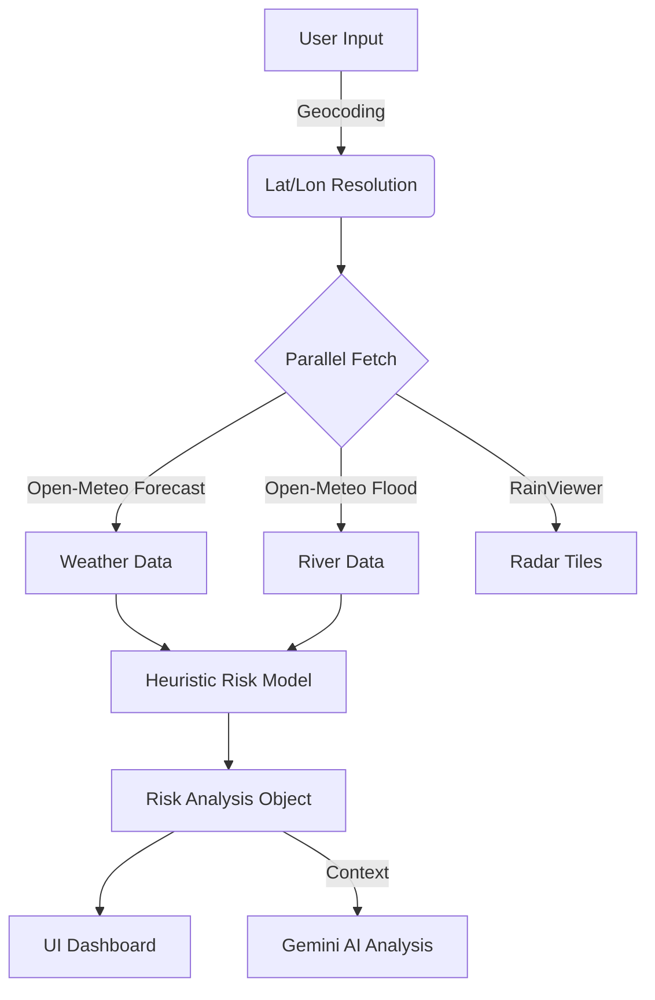

# 🏗️ System Architecture

This document outlines the technical design of **FloodWatch Live**, specifically the data pipeline and the heuristic risk model.

## 1. Data Pipeline

The application relies on a "Parallel Fetch, Convergent Analysis" architecture. When a user searches for a city, the following sequence occurs:

### Key Components

*   **`services/api.ts`**: The centralized data layer. It handles resilient geocoding (splitting City/Country for better accuracy) and fetches data from multiple Open-Meteo endpoints (Forecast, Flood, Elevation).
*   **`services/riskModel.ts`**: The core logic engine (see below).
*   **`services/ai.ts`**: The interface to Google Gemini. It constructs prompts based on the output of the risk model.

## 2. The Heuristic Risk Model (`riskModel.ts`)

We do not rely solely on "Rain Probability." We calculate a composite **Risk Score (0-100)** based on physics-based heuristics.

### The Factors

| Factor | Weight | Logic |
| :--- | :--- | :--- |
| **Soil Saturation** | 35% | If soil moisture > 40% (volumetric), water cannot absorb. Runoff is immediate. |
| **Immediate Rain (24h)** | 45% | Heavy intensity rain in the short term is the primary driver of flash floods. |
| **River Anomaly** | Bonus (+30) | If `Current Discharge` > `Historical Median` * 1.5, the river is "primed" to flood. |
| **Accumulation (7d)** | 10% | Long-duration rain weakens infrastructure and saturates ground. |
| **Forecast (72h)** | 20% | Medium-term outlook. |

### "Blue Sky Flood" Logic
The model specifically checks for a condition where:
*   Local Rain < 5mm (Sunny/Clear)
*   River Discharge > 4x Median (Critical Upstream Flow)

If this condition is met, the Risk Score is forcibly overridden to **High (60+)**, ensuring users are warned about riverine flooding even on a clear day.

## 3. AI Integration Strategy

We use **Gemini 2.5 Flash** in three distinct modes:

1.  **Reasoning (Text):** We feed the raw numbers from the Risk Model into Gemini.
    *   *Prompt Strategy:* "Analyze the interaction between [Soil] and [Rain]. Explain the specific dynamic."
2.  **Grounding (Tools):** We use the `googleMaps` tool to find hospitals.
    *   *Why:* To ensure we never hallucinate a fake emergency shelter.
3.  **Vision (Multimodal):** We send raw image bytes to the model.
    *   *Prompt Strategy:* "Look for depth markers, turbulence, and submerged objects. Verdict: SAFE or DANGER."

## 4. Frontend Optimization

*   **Leaflet Maps:** Configured with `crossOrigin: true` to allow client-side screenshots (html2canvas) for sharing.
*   **Debounced Search:** Reduces API calls during autocomplete.
*   **Dark Mode:** System-aware theme switching using Tailwind classes.
